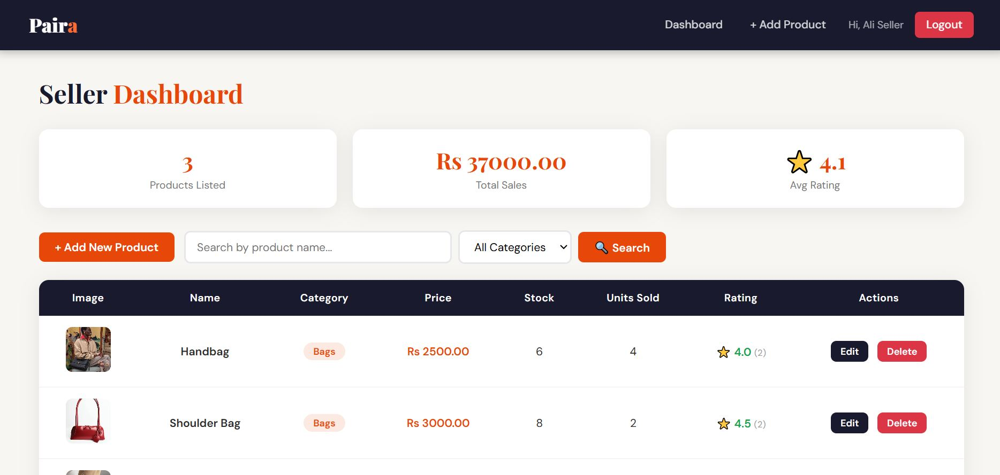
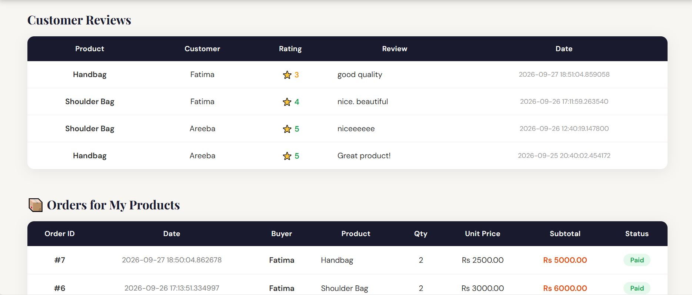
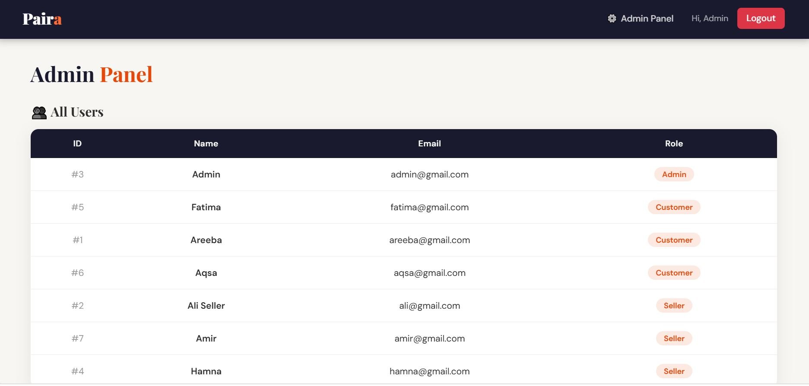
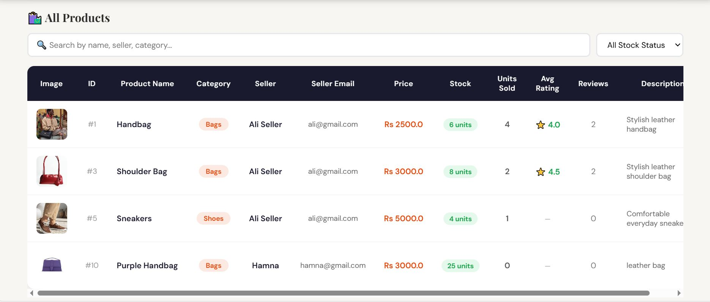
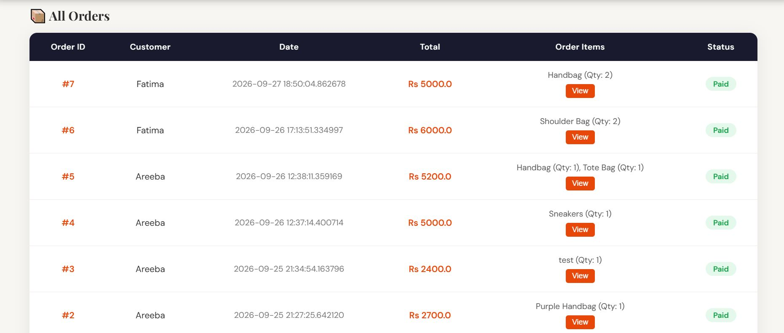

# Paira — AI-Enhanced Online Marketplace

Paira is a role-based online marketplace developed as a team coursework project across Database Systems and Artificial Intelligence. The original application used Oracle; this restored version uses PostgreSQL on Supabase while preserving the marketplace and AI-focused features.

## Screenshots

### Marketplace


### AI Shopping Assistant


### Customer Experience


### Seller Dashboard



### Admin Panel




## Features

- **Guest:** Browse products, search, view reviews and recommendations, and use the shopping assistant
- **Customer:** Registration/login, typo-tolerant search, cart, checkout, orders, ratings, and reviews
- **Seller:** Dashboard, inventory and product management, seller-specific search, reviews, and order visibility
- **Admin:** User, product, and order management, sales overview, and typo-tolerant product search
- Goal-based shopping chatbot
- Greedy Best-First product search
- Similarity-based product recommendations

## Tech Stack

- **Python** — backend programming
- **Flask** — web application framework
- **PostgreSQL / Supabase** — relational database and cloud database hosting
- **psycopg2** — PostgreSQL database connection for Python
- **HTML / CSS / JavaScript** — frontend interface and interactions
- **Jinja2** — dynamic HTML templating

## AI Components

The AI coursework portion uses lightweight and interpretable techniques:

- **Goal-Based Shopping Assistant** — handles common shopping intents and helps users find suitable products
- **Greedy Best-First Search** — ranks product search results according to relevance
- **Typo-Tolerant Matching** — handles approximate queries and minor spelling mistakes
- **Similarity-Based Recommendations** — recommends related products using attributes such as category, price, and rating

## Security Improvements

- Hashes newly created passwords using Werkzeug
- Automatically upgrades legacy plaintext passwords after a successful login
- Keeps database credentials and the Flask secret in `.env`
- Disables Flask debug mode by default
- Removes direct `anon` and `authenticated` access to application tables through the Supabase Data API

> Paira is an academic portfolio project rather than a production commerce platform. A production deployment would require additional security measures such as CSRF protection, rate limiting, hardened session and cookie configuration, monitoring, and a complete deployment security review.

## Setup

Python 3.x is required.

1. Clone or download the repository.
2. Create and activate a Python virtual environment.
3. Install the required dependencies:

   ```bash
   pip install -r requirements.txt
   ```

4. Create a Supabase project.
5. For a **fresh database**, run `supabase_schema.sql` in the Supabase SQL Editor.
6. Copy `.env.example` to `.env` and enter your own Supabase Session Pooler credentials.
7. Generate a strong random value for `FLASK_SECRET_KEY`.
8. Start the application:

   ```bash
   python app.py
   ```

## Environment Variables

The following variables are required in the `.env` file:

```text
DB_HOST
DB_PORT
DB_NAME
DB_USER
DB_PASSWORD
FLASK_SECRET_KEY
FLASK_DEBUG
```

Keep `FLASK_DEBUG=0` for normal use.

Never commit `.env` or database credentials to the repository.

## Project Structure

```text
paira-ai-marketplace/
├── app.py
├── templates/
├── static/
├── screenshots/
├── supabase_schema.sql
├── security_migration.sql
├── requirements.txt
├── .env.example
└── .gitignore
```

## Project Contribution

This was a team coursework project. **Areeba Zubair's contribution** included relational database design, tables and relationships, SQL operations, initial UI/database integration, and the recommendation-system component in the AI-enhanced version.

The repository presents the complete team project while distinguishing individual contribution rather than claiming sole authorship.

## Future Improvements

- Integrate an LLM-powered shopping assistant for more natural and context-aware conversations
- Improve recommendations using user preferences and browsing history
- Add advanced product filtering and personalized search
- Integrate a real payment gateway and shipment tracking
- Add email notifications for orders and account activity
- Improve security with CSRF protection, rate limiting, and hardened session management
- Add automated testing and a production deployment pipeline

## Notes

- The Flask backend connects directly to PostgreSQL over SSL.
- Customer shopping actions are restricted to Customer accounts.
- Seller product-management routes are restricted to Seller accounts and seller-owned products.
- Admin pages are restricted to Admin accounts.
- Product deletion preserves product names in historical order details.